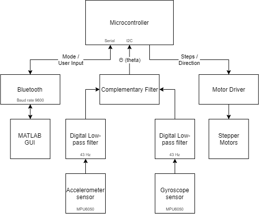

# Self-Balancing-Robot

## Overview

This repository contains the code and documentation for a two-wheeled self-balancing robot developed as a bachelor project. The project utilizes Arduino, stepper motors, Bluetooth communication, and a MATLAB graphical user interface (GUI) for controlling the robot.

## Features

- **Free Run Mode:** Drive the robot easily using the MATLAB GUI.
- **Hold Position Mode:** The robot maintains its position autonomously, while handling any disturbances.
- **Distance Control Mode:** Manually send the robot to a specific distance in centimeters.
- **Balance on Slopes:** Capable of holding its balance on mild slopes, up to 20 degrees.

## Main Components

- **Arduino UNO:** The brain of the robot, handling motor control using drivers and the sensor input.
- **Stepper Motors NEMA 17:** Used for precise control of the robot's movement.
- **Bluetooth Module:** Enables wireless communication with the MATLAB GUI.
- **MPU 6050:** The MPU-6050 devices combine a 3-axis gyroscope and a 3-axis accelerometer on the same silicon die, together with an onboard Digital Motion Processor™ (DMP™), which processes complex 6-axis MotionFusion algorithms.
- **12v Battery**

## Setup and Installation

1. **Arduino Setup:**
   - Upload the Arduino code located in the `SelfBalancing_Robot` folder to the Arduino board.

2. **MATLAB GUI Setup:**
   - Open the MATLAB code in the `MATLAB_Code` folder.
   - Ensure that the Bluetooth module is connected and configured properly.
   - Run the MATLAB script to launch the GUI.

3. **Hardware Connection:**
   - Connect the stepper motors and Bluetooth module according to the provided schematics.

   

## Usage
[Youtube Link to the project!](https://youtu.be/nV-S86kX8dY)

Mohammad Akhavan